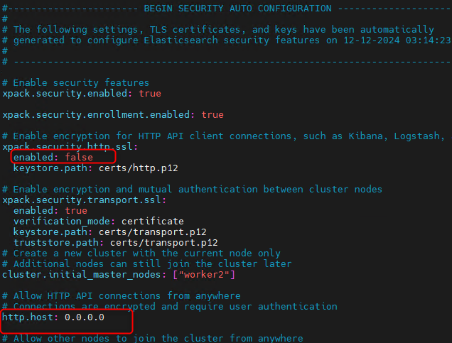
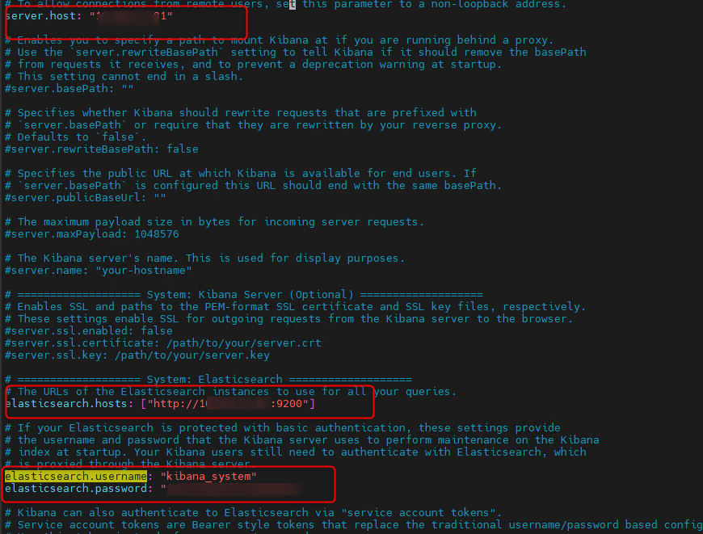
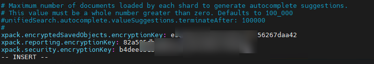

    yum install java-devel
    rpm --import https://artifacts.elastic.co/GPG-KEY-elasticsearch
    wget --no-dns-cache https://artifacts.elastic.co/downloads/elasticsearch/elasticsearch-8.16.0-x86_64.rpm
    rpm --install elasticsearch-8.16.0-x86_64.rpm

    branch=8.16
    curl -o LicenseVerifier.java -s https://raw.githubusercontent.com/elastic/elasticsearch/$branch/x-pack/plugin/core/src/main/java/org/elasticsearch/license/LicenseVerifier.java
    curl -o XPackBuild.java -s https://raw.githubusercontent.com/elastic/elasticsearch/$branch/x-pack/plugin/core/src/main/java/org/elasticsearch/xpack/core/XPackBuild.java

-Modify LicenseVerifier.java 

-Modify XPackBuild.java

    javac -cp "/usr/share/elasticsearch/lib/*:/usr/share/elasticsearch/modules/x-pack-core/*" LicenseVerifier.java

    javac -cp "/usr/share/elasticsearch/lib/*:/usr/share/elasticsearch/modules/x-pack-core/*" XPackBuild.java

    version=8.16.0
    cp /usr/share/elasticsearch/modules/x-pack-core/x-pack-core-$version.jar x-pack-core-$version.jar
    unzip x-pack-core-$version.jar -d ./x-pack-core-$version
    cp LicenseVerifier.class ./x-pack-core-$version/org/elasticsearch/license/
    cp XPackBuild.class ./x-pack-core-$version/org/elasticsearch/xpack/core/
    jar -cvf x-pack-core-$version.crack.jar -C x-pack-core-$version/ .
    rm -rf x-pack-core-$version
	
    cp x-pack-core-$version.crack.jar /usr/share/elasticsearch/modules/x-pack-core/x-pack-core-$version.jar

    vim /etc/elasticsearch/elasticsearch.yml

    systemctl start elasticsearch.service

    wget https://artifacts.elastic.co/downloads/kibana/kibana-8.16.0-x86_64.rpm
    yum localinstall kibana-8.16.0-x86_64.rpm

- Reset the password of the elastic built-in superuser with.

    
    /usr/share/elasticsearch/bin/elasticsearch-reset-password -u kibana_system

    vim /etc/kibana/kibana.yml

    systemctl start kibana.service

    /usr/share/elasticsearch/bin/elasticsearch-reset-password -u elastic

http://127.0.0.1:5601/app/management/stack/license_management (Example path)

- Drop file elastic8.json

- Enable Alert
  - Gen xpack.encryptedSavedObjects.encryptionKey

	/usr/share/kibana/bin/kibana-encryption-keys generate

- Input end file
	

	systemctl restart kibana.service